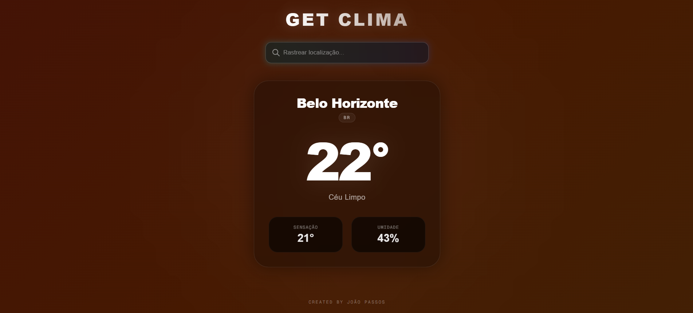

# 🌦️ Get Clima — Dashboard Meteorológico

 Dashboard de clima dinâmico, minimalista e responsivo que consome dados em tempo real para entregar previsões meteorológicas com uma experiência de usuário fluida e moderna.

🚀 **[Clique aqui para acessar o projeto em produção](https://get-clima.vercel.app/)**

---
## 📱 Demonstração do Projeto

<p align="center">
  
</p>

---

## 🛠️ Tecnologias Utilizadas

O projeto foi construído utilizando um ecossistema moderno:

* **Framework:** Next.js 15 (App Router)
* **Linguagem:** TypeScript (Garantindo tipagem estrita e segurança no código)
* **Estilização:** Tailwind CSS (Arquitetura utilitária e design responsivo com efeito de vidro/blur)
* **API de Dados:** OpenWeather API (Consumo dinâmico de dados com otimização de cache no servidor)
* **Hospedagem & CI/CD:** Vercel (Deploy automatizado integrado ao GitHub)

---

## 🎯 Principais Diferenciais Técnicos

Para ir além de um widget simples, implementei boas práticas de engenharia de software:

* **Server-Side Rendering (SSR):** A captura dos dados climáticos ocorre no lado do servidor Next.js através de componentes assíncronos, acelerando o tempo de carregamento inicial.
* **Otimização de Requisições (Cache):** Configuração de revalidação de cache temporal (`revalidate: 1800`) para evitar requisições redundantes à API externa, economizando recursos.
* **Debounce Pattern:** Implementação de atraso controlado no input de busca de cidades para evitar múltiplos disparos desnecessários à API enquanto o usuário digita.
* **UX/UI Fluida:** Layout totalmente responsivo (Mobile-first) integrado com transições de cores baseadas no clima retornado.

---

## 🚀 Como Executar o Projeto Localmente

1. Clone o repositório:
```bash
  git clone https://github.com/Joao-Vitor-Passos/get-clima.git
  
  ```